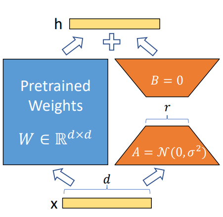

# Understanding about LoRA
Lora is a non-traditional fine-tuning way, which only used in multi-attention transformer.
## Benefits:
- By using it, the pre-trained parameter will not lose. 
- It will save memory, cause parameter in two low-rank matrixs is much less than big one.
## Theroy:
- Decompose the pretrained weights matrix saved in multi-attention layers (blue box) into two low-rank matrixs (yellow box).
- Freeze pretrained-weights in multi-attention layers (blue box), and train it in our new datatsets to update the weights in the low-rank matrixs (yellow box).
- For each one like the figure, the blue box can be Q, K or V in each mutli-attention layer.


## Some technical issues
1. How to determine the rank r?
	It depends on the datasets size, our GPU memory. 
	We can find the best rank number by some tests.
2.  What lora looks like in code?
```
# example of lora block
self.lora_A = nn.Linear(in_features, rank, bias=False)
self.lora_B = nn.Linear(rank, out_features, bias=False)
```
3. How implement LoRA in model?
	 1) define the our LoRA class
	 2) replace some pre-defined layer in model with our LoRA layer (But if not exist such layer in the model, maybe need to add in the model architecture by myself)
	 3) pass some parameters in our LoRA layer
```
# In PitVQA_LoRA
blk.attn.c_attn = _LoRA_qkv(w_qkv, w_a_linear, w_b_linear, self.lora_alpha, self.lora_dropout)
```
`blk.attn.c_attn` is one defined of layer in GPT2, here we use LoRA in all qkv
```
# In SAM_LoRA
blk.attn.qkv = _LoRA_qkv_v0_v2(w_qkv_linear, w_a_linear_q, w_b_linear_q, w_a_linear_v, w_b_linear_v, conv_se_q, conv_se_v)
```
`blk.attn.qkv` is one defined of layer in SAM2, here we use LoRA only in Q and V
4. How define the LoRA class
